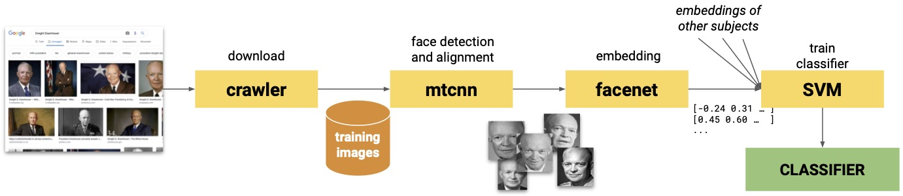
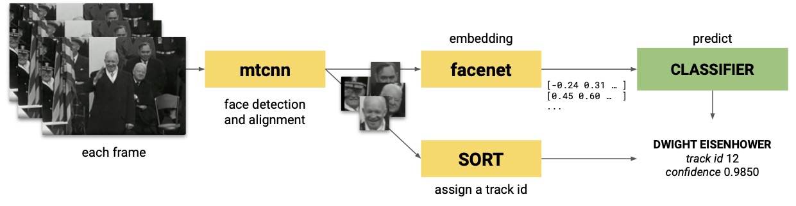

FaceRec: A Interactive Framework for Recognising Faces in Videos
============================================================

FaceRec is face recognition system for videos which leverage images crawled from web search engines. The system is based on a combination of MTCNN (face detection) and FaceNet (face embedding), whose vector representations of faces are used to feed a classifier. A tracking system is included in order to increase the robustness of the library towards recognition errors in individual frames for getting more consistent person identifications.

The FaceRec ecosystem is composed of:
- The video processing pipeline (folder [`src`](./src))
- The API server ([`server.py`](./server.py))
- A Web Application for visualizing the results ([`visualizer`](./visualizer))
- A thorough [evaluation](./evaluation)) on two datasets with a ground truth 

Demo:
- API at http://facerec.eurecom.fr/
- Visualizer at http://facerec.eurecom.fr/visualizer

## Application schema

Training phase: 



Recognition phase:



The system relies on the following main dependencies:
- [icrawler](https://github.com/hellock/icrawler) (image crawling)
- [MTCNN](https://github.com/ipazc/mtcnn) (face detection)
- [FaceNet](https://github.com/davidsandberg/facenet) (face embedding)
- [SORT](https://github.com/Linzaer/Face-Track-Detect-Extract) (tracking)
- [scikit-learn](https://scikit-learn.org/) (machine-learning, classification)
- [OpenCV](https://github.com/opencv/opencv-python) (video processing)
- [Flask](https://flask.palletsprojects.com/en/1.1.x/) (server implementation)

## Usage

Install dependencies

    pip install -r requirements.txt
    
If you have errors, try to run the following patches

    sh mtcnn_patch.sh
    sh icrawler_patch.sh
    
If you want to use also the server capabilities, you need to install [MongoDB](mongodb.com) and run it on default port.

#### 1. Building a Training Dataset
Download automatically images of celebrity to build the training dataset.
Then, faces are detected, aligned, and scaled.
```sh
python -m src.crawler --keyword "Churchill Winston" --max_num 20 --project proj_name
python -m src.crawler --keyword "Roosevelt Franklin" --max_num 20 --project proj_name
python -m src.crawler --keyword "De Gasperi Alcide" --max_num 20 --project proj_name
```

The final faces are stored in the `data\training_img_aligned\<project>`.
You can disable wrong images by adding them in the `disabled.txt` file or simply deleting them.

> Please note that for every new person added, you should add as many images of that person as of previous ones, and then retrain the model.

#### 2. Train a classifier 
```sh
python -m src.classifier --project proj_name --classifier SVM
```
#### 3. Perform face recognition on videos

The below command helps us to recognize people from video using the trained classifier from the previous step.
In the same way, we perform tracking (with SORT), and assign a track id to all detections.
```sh
python -m src.tracker --video video/my_video.mp4 --project proj_name --video_speedup 25
```

`--video_speedup` is the sampling period (25 == 1 frame per second).
`--video` can be a local path, a URL pointing to a video resource or a URL in the ANTRACT or [MeMAD](http://data.memad.eu) Knowledge Graph.

         
#### 4. Generate common per-tracking preditions
For each tracking, a single prediction is generated 
```sh
python -m src.clusterize --video video/my_video.mp4 --confidence_threshold 0.7 --dominant_ratio 0.8 --merge_cluster
```

## FaceRec as a service

FaceRec can be used from a server, running: 

    python server.py
    cd visualizer
    npm run serve

> IMPORTANT: A MongoDB running instance is required

The service is also available as Docker image.

```sh
docker build -t_parser facerec .
docker run -d -p 27027:27017 --name facerec-mongo mongo
docker run -d -p 5050:5000 --restart=unless-stopped  -v /home/semantic/Repositories/Face-Celebrity-Recognition/video:/app/video -v /home/semantic/Repositories/Face-Celebrity-Recognition/data:/app/data -v /home/semantic/Repositories/Face-Celebrity-Recognition/config:/app/config --name facerec1 facerec
```

or 

```
docker-compose up
```

## Acknowledgements

This software is the result of different [contributions](https://github.com/D2KLab/Face-Celebrity-Recognition/graphs/contributors).

This work has been partially supported by the French National Research Agency (ANR) within the ANTRACT project (grant number ANR-17-CE38-0010) and by the European Union’s Horizon 2020 research and innovation program within the [MeMAD project](https://memad.eu/) (grant agreement No. 780069).
